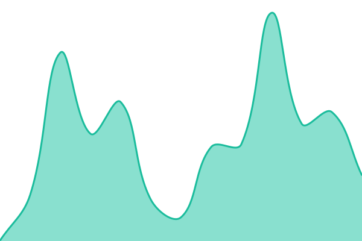
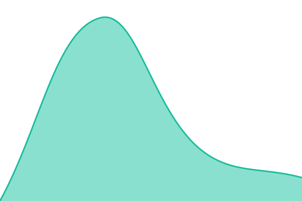
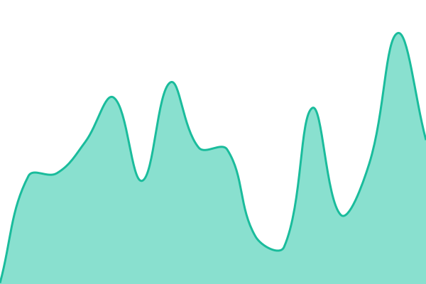
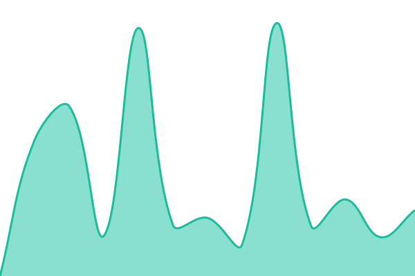

# [📈 Live Status](https://newmanchuria-core.github.io/qf-status): <!--live status--> **所有系统运行正常**

This repository contains the open-source uptime monitor and status page for [newmanchuria-core](https://newmanchuria-core.github.io/qf-status), powered by [Upptime](https://github.com/upptime/upptime).

With [Upptime](https://upptime.js.org), you can get your own unlimited and free uptime monitor and status page, powered entirely by a GitHub repository. We use [Issues](https://github.com/newmanchuria-core/qf-status/issues) as incident reports, [Actions](https://github.com/newmanchuria-core/qf-status/actions) as uptime monitors, and [Pages](https://newmanchuria-core.github.io/qf-status) for the status page.

<!--start: status pages-->
<!-- This summary is generated by Upptime (https://github.com/upptime/upptime) -->
<!-- Do not edit this manually, your changes will be overwritten -->
<!-- prettier-ignore -->
| URL | Status | History | Response Time | Uptime |
| --- | ------ | ------- | ------------- | ------ |
|  [官网首页](https://www.quickfindapp.com/) | 正常 | [官网首页.yml](https://github.com/newmanchuria-core/qf-status/commits/HEAD/history/官网首页.yml) | 

 284ms
     
 | 

<a href="https://status.quickfindapp.com/history/官网首页">0.00%</a>
    

|  [管理后台](https://admin.quickfindapp.com/) | 正常 | [管理后台.yml](https://github.com/newmanchuria-core/qf-status/commits/HEAD/history/管理后台.yml) | 

 683ms
     
 | 

<a href="https://status.quickfindapp.com/history/管理后台">0.00%</a>
    

|  [Releases 分发站首页](https://releases.quickfindapp.com/) | 正常 | [releases.yml](https://github.com/newmanchuria-core/qf-status/commits/HEAD/history/releases.yml) | 

 251ms
     
 | 

<a href="https://status.quickfindapp.com/history/releases">20.17%</a>
    

|  [自动更新源 latest.yml](https://releases.quickfindapp.com/releases/latest.yml) | 正常 | [latest-yml.yml](https://github.com/newmanchuria-core/qf-status/commits/HEAD/history/latest-yml.yml) | 

 141ms
     
 | 

<a href="https://status.quickfindapp.com/history/latest-yml">100.00%</a>
    

|  [Supabase A REST 健康](https://mgbuwpnbfdogdunluyqa.supabase.co/rest/v1/) | 正常 | [supabase-a-rest.yml](https://github.com/newmanchuria-core/qf-status/commits/HEAD/history/supabase-a-rest.yml) | 

 143ms
     
 | 

<a href="https://status.quickfindapp.com/history/supabase-a-rest">100.00%</a>
    

|  [Supabase B Auth 健康](https://kcbkotryhafxcbvyceft.supabase.co/auth/v1/health) | 正常 | [supabase-b-auth.yml](https://github.com/newmanchuria-core/qf-status/commits/HEAD/history/supabase-b-auth.yml) | 

 137ms
     
 | 

<a href="https://status.quickfindapp.com/history/supabase-b-auth">100.00%</a>
    

|  [GitHub Releases 端点](https://github.com/newmanchuria-core/quickfind/releases/latest) | 正常 | [git-hub-releases.yml](https://github.com/newmanchuria-core/qf-status/commits/HEAD/history/git-hub-releases.yml) | 

 610ms
     
 | 

<a href="https://status.quickfindapp.com/history/git-hub-releases">100.00%</a>
    

|  [Windows 安装包（GitHub 资产）](https://github.com/newmanchuria-core/quickfind/releases/download/v1.0.0/QuickFind-Setup-1.0.0-x64.exe) | 正常 | [windows-git-hub.yml](https://github.com/newmanchuria-core/qf-status/commits/HEAD/history/windows-git-hub.yml) | 

 2216ms
     
 | 

<a href="https://status.quickfindapp.com/history/windows-git-hub">100.00%</a>
    

<!--end: status pages-->

[**Visit our status website →**](https://newmanchuria-core.github.io/qf-status)

## 📄 License

- Powered by: [Upptime](https://github.com/upptime/upptime)
- Code: [MIT](./LICENSE) © [Anand Chowdhary](https://anandchowdhary.com)
- Data in the `./history` directory: [Open Database License](https://opendatacommons.org/licenses/odbl/1-0/)
